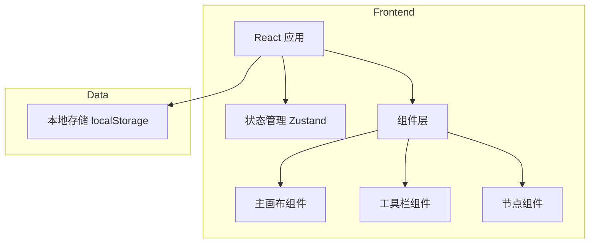
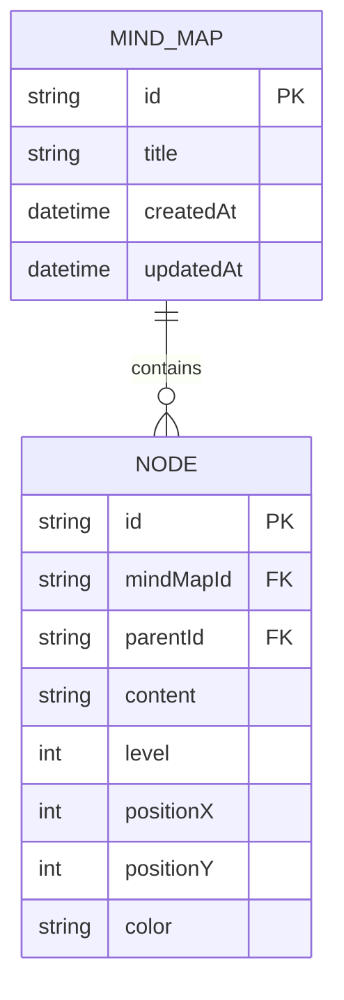

# Web 端思维导图软件 - 技术架构文档

## 1. Architecture Design



## 2. Technology Description
- **Frontend**: React@18 + TypeScript + Tailwind CSS + Vite
- **状态管理**: Zustand
- **渲染**: Canvas/SVG 用于节点和连线渲染
- **存储**: LocalStorage 用于本地保存
- **初始化工具**: vite-init

## 3. Route Definitions
| Route | Purpose |
|-------|---------|
| / | 主页面 - 思维导图编辑器 |

## 4. API Definitions
本项目暂不涉及后端 API，所有数据操作在前端完成。

## 5. Data Model

### 5.1 Data Model Definition



### 5.2 TypeScript 类型定义

```typescript
interface Node {
  id: string;
  parentId: string | null;
  content: string;
  level: number;
  positionX: number;
  positionY: number;
  color: string;
}

interface MindMap {
  id: string;
  title: string;
  nodes: Node[];
  createdAt: Date;
  updatedAt: Date;
}

interface MindMapState {
  currentMindMap: MindMap | null;
  selectedNodeId: string | null;
  addNode: (parentId: string | null, content: string) =&gt; void;
  updateNode: (nodeId: string, updates: Partial&lt;Node&gt;) =&gt; void;
  deleteNode: (nodeId: string) =&gt; void;
  saveMindMap: () =&gt; void;
  loadMindMap: (id: string) =&gt; void;
  createNewMindMap: () =&gt; void;
}
```

### 5.3 项目结构

```
/workspace
├── src/
│   ├── components/
│   │   ├── Toolbar.tsx          # 工具栏组件
│   │   ├── MindMapCanvas.tsx    # 主画布组件
│   │   └── Node.tsx             # 节点组件
│   ├── hooks/
│   │   └── useMindMapStore.ts   # Zustand 状态管理
│   ├── utils/
│   │   └── mindMapUtils.ts      # 思维导图工具函数
│   ├── App.tsx                  # 主应用组件
│   └── main.tsx                 # 入口文件
├── package.json
├── tsconfig.json
├── vite.config.ts
└── tailwind.config.js
```
