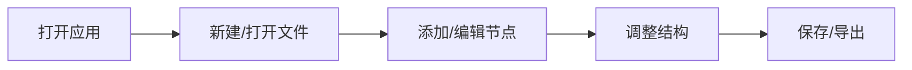

# Web 端思维导图软件 - 产品需求文档 (PRD)

## 1. Product Overview
一款功能完备的 Web 端思维导图应用，类似于 XMind，帮助用户进行头脑风暴、知识管理和项目规划。
- 核心功能包括：创建节点、编辑内容、拖拽调整结构、导出功能
- 目标用户：学生、教师、项目经理、创意工作者等需要可视化思维的人群

## 2. Core Features

### 2.1 User Roles
无需用户角色区分，所有用户拥有相同权限

### 2.2 Feature Module
1. **思维导图编辑页面**：主编辑区，工具栏，节点操作
2. **文件管理**：新建、保存、打开思维导图

### 2.3 Page Details
| Page Name | Module Name | Feature description |
|-----------|-------------|---------------------|
| 思维导图编辑页面 | 主编辑区 | 可视化展示思维导图节点，支持拖拽、缩放、平移 |
| 思维导图编辑页面 | 工具栏 | 提供新建、添加子节点、添加同级节点、删除、撤销/重做、导出等功能 |
| 思维导图编辑页面 | 节点编辑 | 支持双击编辑节点内容，自定义节点颜色 |

## 3. Core Process
用户打开应用 → 新建或导入思维导图 → 在编辑区添加和编辑节点 → 调整节点结构 → 保存或导出思维导图

## 4. User Interface Design

### 4.1 Design Style
- **主色调**：深蓝色 (#1E3A5F) 搭配柔和的中性色
- **辅助色**：不同节点使用渐变色彩区分层级
- **按钮风格**：圆角矩形，轻微阴影，悬停时有优雅的缩放动画
- **字体**：Inter 或类似现代无衬线字体，清晰易读
- **布局风格**：简洁的顶部工具栏 + 全屏编辑画布
- **视觉元素**：节点之间使用平滑曲线连接，支持节点图标和颜色标记

### 4.2 Page Design Overview
| Page Name | Module Name | UI Elements |
|-----------|-------------|-------------|
| 编辑页面 | 工具栏 | 固定在顶部，带有图标按钮，悬停显示提示 |
| 编辑页面 | 主画布 | 深色背景，支持网格，节点可拖拽 |
| 编辑页面 | 节点样式 | 圆角卡片，带边框和阴影，支持渐变背景 |

### 4.3 Responsiveness
- 桌面端为主，支持平板适配
- 触控设备优化，支持手势操作

### 4.4 3D Scene Guidance
本项目暂不涉及 3D 场景
